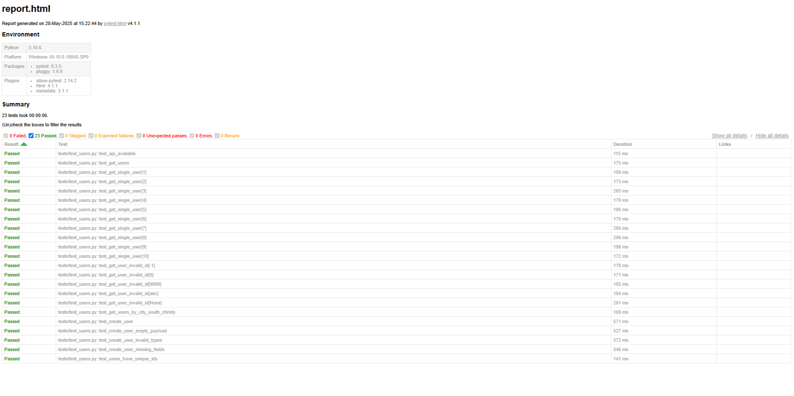

# 🧪 API Testing Project — JSONPlaceholder


Pet-проект по автоматизации тестирования REST API с помощью `Python + Pytest`.

Проект проверяет фейковый API [jsonplaceholder.typicode.com](https://jsonplaceholder.typicode.com) и демонстрирует навыки:
- написания автотестов
- валидации данных
- обработки ошибок
- тест-дизайна и параметризации
- подготовки отчётов

---

## 🔍 Что покрыто тестами

- ✅ Получение всех пользователей `/users`
- ✅ Получение пользователя по ID `/users/{id}`
- ✅ Поиск пользователей по городу
- ✅ Проверка уникальности ID
- ✅ Создание пользователя (`POST /users`)
- ✅ Негативные кейсы (404, пустые поля, неправильные типы)
- ✅ Валидация структуры через `jsonschema`
- ✅ Smoke-тест: API отвечает
- ✅ HTML-отчёты с `pytest-html`

---

## 📁 Структура проекта

api_testing_project/
├── api/ # API-запросы
├── schemas/ # JSON-схемы
├── tests/ # Тесты Pytest
├── utils/ # Утилиты (валидация)
├── requirements.txt
├── .gitignore
└── README.md


---

## 🛠 Установка и запуск

```bash
git clone https://github.com/TomOstin/api-testing-project.git
cd api-testing-project
python -m venv .venv
.venv\Scripts\activate      # Windows
pip install -r requirements.txt

---

Запуск тестов:

Все тесты:
pytest tests/

С HTML-отчётом:
pytest tests/ --html=reports/report.html

---

def test_get_user_by_id():
    user = get_user_by_id(1)
    assert user["id"] == 1
    validate_user_schema(user, user_schema)
    
---
## 🧪 Тестовый отчёт

Пример отчёта после запуска тестов:



---

Примечание
Проект работает с фейковым API, который не реализует реальную валидацию.
Все POST-запросы "успешны", даже с некорректными данными.

---

Автор
Tom Ostin
Python-разработчик и тестировщик
